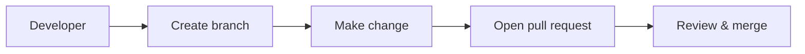

# Mermaid diagrams — safe, non‑interfering guide

Summary
- Adding Mermaid source is safe: Mermaid blocks are plain text (not executable code) and will not run or change your codebase.
- The safest, least intrusive place for diagrams is a docs/ directory (for example `docs/diagrams/`) as text files (`.md` or `.mmd`). These are easy to version, review, and update without affecting builds or runtime behavior.

Does adding Mermaid cause problems?
- No, Mermaid source in Markdown is just text. It does not run on your machines or in CI unless you explicitly add tooling that executes it.
- Potential minor issues to be aware of:
  - Some CI or repository linters may scan Markdown files; very rarely a repo has a rule that blocks certain file types or content. If you have markdown linters (markdownlint) or doc build steps, they might flag style issues but will not execute the Mermaid.
  - Committing large binary exports (SVG/PNG) increases repo size; prefer text `.mmd` or inline fenced blocks.
  - Older self-hosted GitHub Enterprise versions may not render Mermaid in the web UI. That only affects rendering, not safety.

Recommended structure (non-interfering)
- Add text-only diagram source into:
  - docs/diagrams/*.mmd — Mermaid source files (one diagram per .mmd)
  - docs/diagrams/README.md — usage notes and examples (this file)
- Do not add build scripts or CI steps that process `.mmd` files unless intended. Keeping them in docs/ prevents accidental execution in build pipelines.

How to use (examples)

1) Inline in a Markdown file (renders on github.com)


2) Example .mmd file contents (docs/diagrams/example.mmd)
```text
%% Example Mermaid source file: docs/diagrams/example.mmd
flowchart TD
  Client -->|request| LoadBalancer
  LoadBalancer --> Service
  Service --> Database
  Database --> Service
  Service --> Client
```

How to reference or include diagrams in docs or PRs
- Option A: Put the Mermaid block directly inside a `.md` file (GitHub renders it).
- Option B: Keep the source in `.mmd` files for versioning, and copy the source into `.md` for rendering where needed (or link to the `.mmd` file for maintainers).
- If your environment doesn't render Mermaid, export an optimized SVG and commit it to `docs/diagrams/` (avoid large files).

Accessibility & review tips
- Always add a one-line description near the diagram explaining what it shows.
- For images (SVG/PNG) include alt text (e.g., ``).
- Using text `.mmd` is best for diffs and reviews.

How to add this file quickly (web UI — zero local setup)
1. In GitHub: Code → Add file → Create new file.
2. Path: `docs/diagrams/mermaid-guidelines.md` (paste this file content).
3. Commit to a new branch and open a Pull Request.

Notes about CI and repo safety
- Adding this Markdown file alone does not change code or runtime behavior.
- If you or your team have repository policies or automated scripts that watch docs changes, mention `docs`-only changes in your PR to avoid confusion.
- If you want absolute isolation, create a new branch and open a PR that only adds files under `docs/diagrams/`.

Next steps I can take for you
- I can generate one or more specific Mermaid diagrams if you tell me the workflow/components to visualize.
- If you want, I can produce the exact file contents ready to paste (or create a PR for you if you share the repository name and give permission). Which would you like?
